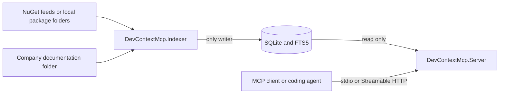

# Dev Context MCP Server

Dev Context MCP is a .NET 10 Model Context Protocol server that gives coding
agents grounded, version-aware access to internal NuGet packages and company
documentation.

It indexes package metadata, README files, XML documentation, packaged text
files, public .NET symbols, dependencies, target frameworks, and an optional
documentation directory. Agents can then discover libraries, select an indexed
version, search documentation, inspect real API signatures, and open the exact
source material behind each answer.

The system never loads or executes package assemblies. Retrieval is served
entirely from a local SQLite/FTS5 index.

## Why This Project Exists

Coding agents often know public libraries but lack reliable context for private
packages, generated API clients, environment-specific builds, and company
standards. Dev Context MCP turns those sources into a small, deterministic MCP
surface:

- Package discovery by exact ID or implementation concept.
- Explicit environment and semantic-version selection.
- Documentation search isolated to one package version.
- Metadata-only lookup of public types and members.
- Stable citations that can be opened as MCP resources.
- Machine-readable `ok`, `not_found`, and `insufficient_evidence` outcomes.

Generated clients do not need special handling. If a client is published as a
NuGet package with public assemblies and useful documentation, it follows the
same indexing and retrieval path as any other package.

## How It Works

Index production and MCP retrieval are separate processes:



1. The one-shot Indexer reads configured sources and package-policy files.
2. It safely downloads or opens selected `.nupkg` files.
3. It extracts metadata, documents, and symbols without executing package code.
4. It atomically publishes changed content to SQLite and updates FTS5.
5. The Server opens the same database read-only and exposes MCP tools and
   resources.

Run only one Indexer process against a database at a time. The Server can stay
independent of feeds and credentials because it never refreshes data itself.

## Repository Layout

| Path | Responsibility |
| --- | --- |
| `src/DevContextMcp.Server.Core` | MCP contracts, retrieval models, version resolution, ranking, citations, and handler interfaces. |
| `src/DevContextMcp.Indexer.Core` | Source-neutral indexing models, ports, and orchestration. |
| `src/DevContextMcp.Infrastructure` | NuGet access, safe archive processing, metadata symbol extraction, SQLite persistence, and FTS5 retrieval. |
| `src/DevContextMcp.Indexer` | One-shot indexer executable, configuration, validation, and reporting. |
| `src/DevContextMcp.Server` | Retrieval-only MCP host, tools, resources, transports, diagnostics, and logging. |
| `tests/DevContextMcp.UnitTests` | Unit and architecture tests. |
| `tests/DevContextMcp.IntegrationTests` | End-to-end indexing, retrieval, startup, stdio, and HTTP tests. |
| `demo/data` | Ready-to-use package policies, local feeds, and company-document examples. |
| `demo/nuget-apps` | Source projects used to build the demo packages. |
| `design` | Product specification, architecture, stage plans, and test notes. |
| `scripts/dist.ps1` | Windows self-contained distribution builder. |

The dependency direction is intentionally narrow:

```text
Server.Core  -> no project references
Indexer.Core -> no project references
Infrastructure -> Server.Core + Indexer.Core
Server -> Server.Core + Infrastructure
Indexer -> Indexer.Core + Infrastructure
```

Architecture tests enforce these boundaries and ensure the Server does not
compose index-writing services.

## Quick Start

### Prerequisites

- The .NET SDK selected by [`global.json`](global.json), currently .NET SDK
  `10.0.301` with latest-patch roll-forward.
- Internet access when restoring packages and when indexing the bundled public
  NuGet example.
- Node.js only if you want to use MCP Inspector.

### 1. Build and test

Run from the repository root:

```powershell
dotnet restore .\DevContextMcp.slnx
dotnet build .\DevContextMcp.slnx --no-restore
dotnet test .\DevContextMcp.slnx --no-build --no-restore
```

### 2. Build the local index

The checked-in Indexer configuration uses:

- NuGet.org for `Formula.SimpleRepo`.
- Local `prod` and `qa` feeds under `demo/data/nuget-repos`.
- Package policies under `demo/data/indexer/nugets`.
- Company documents under `demo/data/indexer/company-docs`.

Run one complete indexing pass:

```powershell
dotnet run --project .\src\DevContextMcp.Indexer\DevContextMcp.Indexer.csproj
```

The demo database is created at `database/docs.db`. Exit code `0` means all
configured sources succeeded or no sources were configured. Exit code `1`
means configuration failed, indexing was canceled, or at least one source did
not complete successfully.

Re-running the command is safe. Content hashes prevent unchanged package data
from being rewritten, while index-run history records each execution.

### 3. Start the MCP server

The checked-in development configuration starts stateless Streamable HTTP at:

```text
http://127.0.0.1:2222/mcp
```

```powershell
dotnet run --project .\src\DevContextMcp.Server\DevContextMcp.Server.csproj
```

HTTP is deliberately restricted to an unauthenticated loopback `http://`
address. It is suitable for local development, not shared-network deployment.

To use stdio instead:

```powershell
dotnet run --project .\src\DevContextMcp.Server\DevContextMcp.Server.csproj `
  -- --DevContextMcp:Transport=stdio
```

Standard output is reserved for MCP protocol messages in stdio mode. Logs are
written to standard error and to the configured Serilog file sink.

### 4. Connect MCP Inspector

For the default HTTP configuration, start the Server and then run:

```powershell
npx -y @modelcontextprotocol/inspector
```

Choose **Streamable HTTP** and connect to
`http://127.0.0.1:2222/mcp`.

For stdio, Inspector can launch the process directly:

```powershell
npx -y @modelcontextprotocol/inspector dotnet run `
  --project .\src\DevContextMcp.Server\DevContextMcp.Server.csproj `
  -- --DevContextMcp:Transport=stdio
```

Try this workflow after connecting:

1. Call `resolve_library` with `Demo.Cities`.
2. Pass a returned ID such as `nuget:prod/Demo.Cities` to `list_versions`.
3. Call `query_docs` or `get_symbol` with the selected version.
4. Open a returned `nuget://` citation under Resources.
5. Query `docs:company-docs` for the bundled company-document examples.

## MCP Surface

### Tools

| Tool | Purpose | Important inputs |
| --- | --- | --- |
| `resolve_library` | Finds indexed NuGet packages or company documentation by ID, name, or concept. | `query`, `environment`, `includePrerelease`, `limit` |
| `list_versions` | Lists indexed package versions and identifies the recommended version. | `libraryId`, `includePrerelease` |
| `query_docs` | Searches version-scoped package evidence or company documents. | `libraryId`, `question`, `version`, `projectVersion`, `targetFramework`, `maxResults` |
| `get_symbol` | Finds a public type or member and returns its indexed signature and XML documentation. | `libraryId`, `symbol`, `version`, `projectVersion`, `targetFramework` |

`get_symbol` accepts fully qualified, simple, or partial names. If a lookup is
ambiguous, it returns bounded candidates instead of silently choosing one.
Symbol lookup is not supported for `docs:company-docs`.

### Library IDs

Discovery returns stable IDs:

```text
nuget:prod/Demo.Cities
nuget:qa/Demo.Cities
docs:company-docs
```

An environment-qualified NuGet ID never falls back to another environment.
Legacy IDs such as `nuget:Demo.Cities` use the configured environment and
source order.

Company documentation is one versionless library. `query_docs` and resource
reads apply to it; NuGet version and symbol operations do not.

### Resources and citations

Tool evidence points to read-only MCP resources:

```text
nuget://{source}/{packageId}/{version}/artifact/{path}
nuget://{source}/{packageId}/{version}/symbol/{qualifiedName}
docs://company-docs/{path}
```

Opening a resource reads the exact indexed artifact or symbol. The Server does
not contact a NuGet feed during retrieval.

## Version Selection

For `query_docs` and `get_symbol`, one version is selected in this order:

1. Exact `version` from the tool request.
2. Exact `projectVersion` supplied as calling-project context.
3. Environment-qualified `RecommendedVersions` entry.
4. Package-wide `RecommendedVersions` entry.
5. Latest indexed, listed stable version.
6. Latest indexed, listed prerelease when prereleases are allowed.

The selected version must already be in the local index. Evidence from
different package versions is never combined.

## Indexer Configuration

The Indexer loads `src/DevContextMcp.Indexer/appsettings.json` from the
executable directory, followed by standard .NET environment-variable and
command-line overrides.

A minimal configuration looks like this:

```json
{
  "DevContextMcp": {
    "DatabasePath": "data/docs.db",
    "NugetsPath": "nugets",
    "Environments": [
      {
        "Name": "production",
        "ServiceIndex": "https://packages.example/v3/index.json",
        "MaxPackages": 100
      }
    ],
    "Documentation": {
      "RootPath": "C:\\company\\docs",
      "Extensions": [ ".md", ".txt" ]
    },
    "Indexing": {
      "MaxPackageBytes": 104857600,
      "MaxDocumentBytes": 20971520,
      "MaxArchiveEntries": 10000,
      "MaxExtractedBytes": 524288000,
      "MaxCompressionRatio": 200,
      "MaxDocumentChars": 4000,
      "PackageDownloadTimeout": "00:02:00"
    }
  }
}
```

Each environment is either an absolute HTTP/HTTPS NuGet v3 service index or a
local directory containing `.nupkg` files. Its `Name` is the environment slug
used in library IDs and citations.

### Package policy files

Create one JSON file per exact package ID anywhere below `NugetsPath`:

```json
{
  "Environment": "production",
  "PackageId": "Company.Foundation",
  "MaxVersionsPerPackage": 3,
  "IncludePrerelease": false,
  "IncludeUnlisted": false
}
```

Files are loaded recursively and matched to the environment with the same
name. The version limit controls what is selected on that run; lowering it
does not remove versions already stored in the index.

Deletion is explicit. Keep a tombstone file to remove every indexed version of
a package from one environment:

```json
{
  "Delete": true,
  "Environment": "production",
  "PackageId": "Company.Foundation"
}
```

Removing a policy file, removing a package from a feed, or reducing a version
limit does not delete previously indexed data. A matching `Delete: true`
tombstone is the deletion mechanism.

### Company documentation

The optional `Documentation` section indexes one directory recursively as
`docs:company-docs`.

- Only configured extensions are included.
- Hidden entries, dot-prefixed entries, links, and reparse points are skipped.
- Files must be valid UTF-8 and stay within the configured size limit.
- Each file is stored as a complete resource and split into searchable chunks.

## Server Configuration

The Server separately loads `src/DevContextMcp.Server/appsettings.json` from
its executable directory. Point it at the same database written by the
Indexer:

```json
{
  "DevContextMcp": {
    "Transport": "stdio",
    "Http": {
      "Url": "http://127.0.0.1:2222",
      "Path": "/mcp"
    },
    "DatabasePath": "data/docs.db",
    "RecommendedVersions": {
      "Company.Foundation": "4.0.0",
      "nuget:qa/Company.Foundation": "4.1.0-beta.1"
    },
    "Retrieval": {
      "EnvironmentOrder": [ "production", "qa" ],
      "SourceOrder": [ "internal" ],
      "DefaultMaxResults": 8,
      "MaxResults": 25,
      "MaxResponseBytes": 102400,
      "QueryTimeout": "00:00:05",
      "MinimumEvidenceScore": 0.15,
      "AmbiguousSymbolLimit": 10
    },
    "ToolLogging": {
      "MaxPayloadBytes": 32768
    }
  }
}
```

Key behavior:

- `DatabasePath` is opened read-only and must already contain a current index.
- `EnvironmentOrder` controls legacy unqualified NuGet IDs.
- `RecommendedVersions` supports package-wide and environment-qualified keys.
- Result count, evidence score, response bytes, and query duration are bounded.
- HTTP validation permits only an absolute loopback HTTP URL.
- Invalid configuration fails startup instead of silently falling back.

Environment variables use double underscores:

```powershell
$env:DevContextMcp__DatabasePath = "C:\dev-context\data\docs.db"
$env:DevContextMcp__Retrieval__EnvironmentOrder__0 = "production"
```

Command-line overrides use colon-separated keys:

```powershell
dotnet run --project .\src\DevContextMcp.Server\DevContextMcp.Server.csproj `
  -- --DevContextMcp:Transport=http `
     --DevContextMcp:Http:Url=http://127.0.0.1:5034
```

Restart the Server after changing its configuration. Rerun the Indexer after
changing indexing configuration, package policies, feeds, or source documents.

## Indexed Content and Safety

For each selected NuGet version, the Indexer stores:

- Package identity, title, description, authors, tags, URLs, and publication
  state.
- Dependencies and target frameworks.
- Markdown, text, and XML documentation.
- Public symbols from assemblies under `ref/` and `lib/`.
- Content hashes, searchable document chunks, and run diagnostics.

Package archives are treated as untrusted input. Processing enforces package
size, document size, archive entry count, extracted-size, and compression-ratio
limits. Paths are validated against traversal, and assemblies are inspected
through metadata APIs rather than loaded into the runtime.

SQLite publication is transactional. A failed package refresh preserves the
last successfully indexed data. The Server applies query timeouts, result
limits, response budgets, and citation-safe URI encoding.

Do not put feed credentials or API tokens in package-policy files or the
checked-in settings. Source authentication is intentionally isolated behind an
infrastructure interface for future approved credential providers.

## Distribution

Create self-contained Windows x64 builds:

```powershell
powershell -NoProfile -ExecutionPolicy Bypass -File .\scripts\dist.ps1
```

Outputs are written under `artifacts/dist/win-x64`:

```text
server/
indexer/
data/
server.cmd
indexer.cmd
DevContextMcp.Server-win-x64.zip
DevContextMcp.Indexer-win-x64.zip
```

The script publishes both applications, rewrites their database and package
paths for the distribution layout, creates launchers, and validates each ZIP.
If no usable .NET SDK is installed, it can download the SDK version from
`global.json` into `artifacts/tools/dotnet` without changing the machine-wide
installation.

For a combined deployment, keep the extracted `server`, `indexer`, and `data`
directories under the same parent. Run `indexer.cmd` to refresh the index and
`server.cmd` to serve it.

## Development and Testing

Run the complete suite:

```powershell
dotnet test .\DevContextMcp.slnx
```

The test projects cover:

- Configuration validation and path resolution.
- Project dependency and registration boundaries.
- Archive safety, chunking, hashing, and metadata symbol extraction.
- Version resolution, ranking, response budgets, and serialization.
- SQLite indexing, FTS retrieval, idempotency, and deletion tombstones.
- Company-document indexing and retrieval.
- MCP tool discovery, resources, stdio, HTTP, startup, and failure behavior.
- Indexer child-process exit codes and diagnostics.

When changing retrieval behavior, preserve deterministic ordering, package
version isolation, explicit failure statuses, and resolvable citations. When
changing indexing behavior, preserve archive safety and atomic publication.

## Further Reading

- [Product specification](design/spec.md)
- [Solution architecture](design/architecture.md)
- [Test plan](design/test-plan.md)
- [Project ideas and background](design/idea.md)
- [Current work list](design/todo.md)
- [Stage plans](design/stages)

The design documents contain historical stage context. This README describes
the current repository and its end-to-end operating model.
