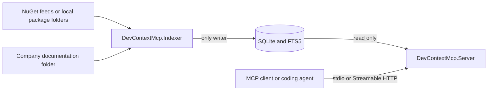

# Dev Context MCP Server

Dev Context MCP is a .NET 10 Model Context Protocol server that gives coding
agents grounded, version-aware access to internal NuGet packages and company
documentation.

It indexes package metadata, README files, XML documentation, packaged text
files, public .NET symbols, dependencies, target frameworks, and an optional
documentation directory. Agents can then discover libraries, select an indexed
version, search documentation, inspect real API signatures, and open the exact
source material behind each answer.

The system never loads or executes package assemblies. Retrieval is served
entirely from a local SQLite/FTS5 index.

## Why This Project Exists

Coding agents often know public libraries but lack reliable context for private
packages, generated API clients, environment-specific builds, and company
standards. Dev Context MCP turns those sources into a small, deterministic MCP
surface:

- Package discovery by exact ID or implementation concept.
- Explicit environment and semantic-version selection.
- Documentation search isolated to one package version.
- Metadata-only lookup of public types and members.
- Stable citations that can be opened as MCP resources.
- Machine-readable `ok`, `not_found`, and `insufficient_evidence` outcomes.

Generated clients do not need special handling. If a client is published as a
NuGet package with public assemblies and useful documentation, it follows the
same indexing and retrieval path as any other package.

## How It Works

Index production and MCP retrieval are separate processes:



1. The one-shot Indexer reads configured sources and package-policy files.
2. It safely downloads or opens selected `.nupkg` files.
3. It extracts metadata, documents, and symbols without executing package code.
4. It atomically publishes changed content to SQLite and updates FTS5.
5. The Server opens the same database read-only and exposes MCP tools and
   resources.

Run only one Indexer process against a database at a time. The Server can stay
independent of feeds and credentials because it never refreshes data itself.

- [Product specification](design/spec.md)
- [Solution architecture](design/architecture.md)

> Solution was designed and implemented with Codex AI agent using specs and plans defined in [design folder](./design/).

**Configuration:**
- [Indexer Configuration](./docs/indexer-configuration.md) — how to set up indexing sources, package policies, and documentation paths.
- [Server Configuration](./docs/server-configuration.md) — how to configure transport (stdio or HTTP) and logging.

## Demo

Repository contains Demo Indexer data for [Demo Project](https://github.com/sbuyevich/demo-dev-context-mcp-server). The demo project design and implementation were AI-generated using DevContext MCP server. The [demo folder](./demo/) contains:

**Demo Applications** — .NET applications that generate demo NuGet packages:
- [Demo.Cities](./demo/nuget-apps/Demo.Cities/) — generates `prod` and `qa` versions of a sample NuGet package.
- [OpenMeteo.Api.Client](./demo/nuget-apps/OpenMeteo.Client/) — OpenAPI-generated client library.

**Demo Data** — source material for indexing:
- [NuGets Repo](./demo/data/nuget-repos/) — contains `.nupkg` files organized by `prod` and `qa` feeds (paths defined in Indexer Configuration).
- [Indexer](./demo/data/indexer/) — documentation files and package policies for indexing.

## Quick Start

### Prerequisites

- The .NET SDK selected by [`global.json`](global.json), currently .NET SDK
  `10.0.301` with latest-patch roll-forward.
- Internet access when restoring packages and when indexing the bundled public
  NuGet example.

### 1. Build and test

```powershell
dotnet build .\DevContextMcp.slnx
dotnet test .\DevContextMcp.slnx
```

### 2. Build the local index

The checked-in Indexer configuration uses:

- NuGet.org for `Formula.SimpleRepo`.
- Local `prod` and `qa` feeds under `demo/data/nuget-repos`.
- Package policies under `demo/data/indexer/nugets`.
- Company documents under `demo/data/indexer/company-docs`.

Run the Indexer:

```powershell
dotnet run --project .\src\DevContextMcp.Indexer\DevContextMcp.Indexer.csproj
```

The demo database is created at `database/docs.db`.
> Re-running the command is safe. Content hashes prevent unchanged package data
> from being rewritten, while index-run history records each execution.

### 3. Start the MCP server

Run the server:

```powershell
dotnet run --project .\src\DevContextMcp.Server\DevContextMcp.Server.csproj
```

The checked-in development configuration starts stateless Streamable HTTP at:

```text
http://127.0.0.1:2222/mcp
```
HTTP is deliberately restricted to an unauthenticated loopback `http://`
address. It is suitable for local development, not shared-network deployment.
Logs are written to standard error and to the configured Serilog file sink.

### 4. Connect MCP Inspector

For the default HTTP configuration, start the Server and then run:

```powershell
npx -y @modelcontextprotocol/inspector
```

Choose **Streamable HTTP** and connect to
`http://127.0.0.1:2222/mcp`.

Try this workflow after connecting:

1. Call `resolve_library` with `Demo.Cities`.
2. Pass a returned ID such as `nuget:prod/Demo.Cities` to `list_versions`.
3. Call `query_docs` or `get_symbol` with the selected version.
4. Open a returned `nuget://` citation under Resources.
5. Query `docs:company-docs` for the bundled company-document examples.

## MCP Surface

### Tools

| Tool | Purpose | Important inputs |
| --- | --- | --- |
| `resolve_library` | Finds indexed NuGet packages or company documentation by ID, name, or concept. | `query`, `environment`, `includePrerelease`, `limit` |
| `list_versions` | Lists indexed package versions and identifies the recommended version. | `libraryId`, `includePrerelease` |
| `query_docs` | Searches version-scoped package evidence or company documents. | `libraryId`, `question`, `version`, `projectVersion`, `targetFramework`, `maxResults` |
| `get_symbol` | Finds a public type or member and returns its indexed signature and XML documentation. | `libraryId`, `symbol`, `version`, `projectVersion`, `targetFramework` |

`get_symbol` accepts fully qualified, simple, or partial names. If a lookup is
ambiguous, it returns bounded candidates instead of silently choosing one.
Symbol lookup is not supported for `docs:company-docs`.

### Library IDs

Discovery returns stable IDs:

```text
nuget:prod/Demo.Cities
nuget:qa/Demo.Cities
docs:company-docs
```

An environment-qualified NuGet ID never falls back to another environment.
Legacy IDs such as `nuget:Demo.Cities` use the configured environment and
source order.

Company documentation is one versionless library. `query_docs` and resource
reads apply to it; NuGet version and symbol operations do not.

### Resources and citations

Tool evidence points to read-only MCP resources:

```text
nuget://{source}/{packageId}/{version}/artifact/{path}
nuget://{source}/{packageId}/{version}/symbol/{qualifiedName}
docs://company-docs/{path}
```

Opening a resource reads the exact indexed artifact or symbol. The Server does
not contact a NuGet feed during retrieval.

## Version Selection

For `query_docs` and `get_symbol`, one version is selected in this order:

1. Exact `version` from the tool request.
2. Exact `projectVersion` supplied as calling-project context.
3. Environment-qualified version selection entry.
4. Package-wide version selection entry.
5. Latest indexed, listed stable version.
6. Latest indexed, listed prerelease when prereleases are allowed.

The selected version must already be in the local index. Evidence from
different package versions is never combined.

**Example:** If `Demo.Cities` has indexed versions `1.0.0`, `1.1.0` (stable), and `2.0.0-beta` (prerelease):
- A tool request with `version: "1.0.0"` uses `1.0.0`.
- No explicit version and latest stable returns `1.1.0`.
- If `includePrerelease: true` and no explicit version, returns `2.0.0-beta`.

## Indexed Content and Safety

For each selected NuGet version, the Indexer stores:

- Package identity, title, description, authors, tags, URLs, and publication
  state.
- Dependencies and target frameworks.
- Markdown, text, and XML documentation.
- Public symbols from assemblies under `ref/` and `lib/`.
- Content hashes, searchable document chunks, and run diagnostics.

Package archives are treated as untrusted input. Processing enforces package
size, document size, archive entry count, extracted-size, and compression-ratio
limits. Paths are validated against traversal, and assemblies are inspected
through metadata APIs rather than loaded into the runtime.

SQLite publication is transactional. A failed package refresh preserves the
last successfully indexed data. The Server applies query timeouts, result
limits, response budgets, and citation-safe URI encoding.

Do not put feed credentials or API tokens in package-policy files or the
checked-in settings. Source authentication is intentionally isolated behind an
infrastructure interface for future approved credential providers.

## Further Reading

- [Product specification](design/spec.md)
- [Solution architecture](design/architecture.md)
- [Stage plans](design/stages)
- [Test plan](design/test-plan.md)

The design documents contain historical stage context. This README describes
the current repository and its end-to-end operating model.
